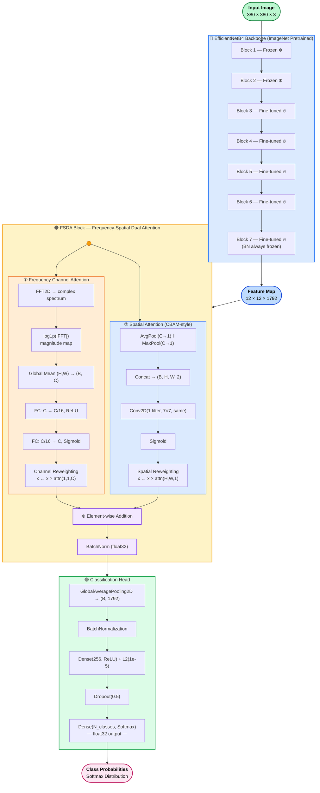
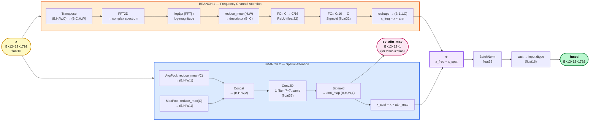
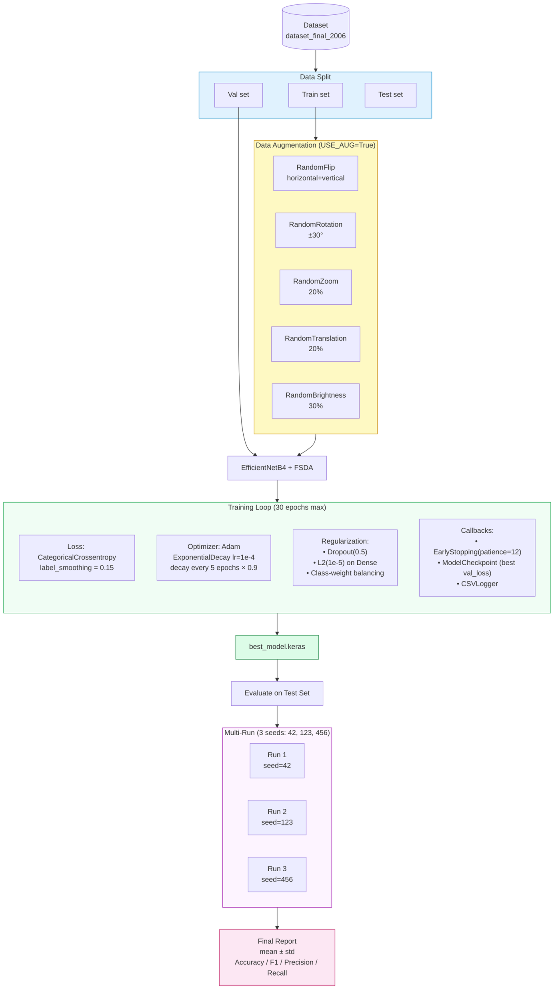
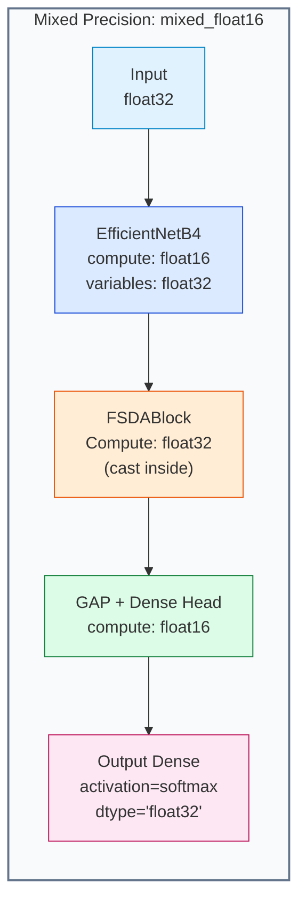

# EfficientNetB4 + FSDA — Mermaid Diagrams

# Paste từng block bên dưới vào https://mermaid.live

# ════════════════════════════════════════════════════════════════

# DIAGRAM 1: TỔNG QUAN KIẾN TRÚC (Overall Architecture)

# ════════════════════════════════════════════════════════════════

---

# ════════════════════════════════════════════════════════════════

# DIAGRAM 2: FSDA BLOCK — CHI TIẾT (Zoom-in)

# ════════════════════════════════════════════════════════════════

---

# ════════════════════════════════════════════════════════════════

# DIAGRAM 3: TRAINING STRATEGY

# ════════════════════════════════════════════════════════════════

---

# ════════════════════════════════════════════════════════════════

# DIAGRAM 4: MIXED PRECISION FLOW

# ════════════════════════════════════════════════════════════════

